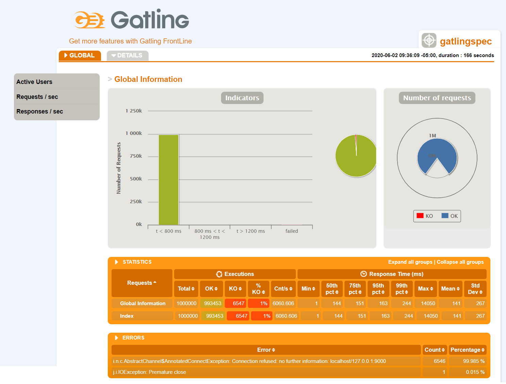

# Play Services

[Play Framework](https://www.playframework.com/documentation/2.8.x/Home) is a lightweight, stateless and highly scalable web application framework with minimal resource consumption. Play is built on top of Akka and Akka HTTP which enables to develop lightning-fast applications. Although Play is based on MVC programming model, it also offers tools to create fully-featured REST APIs as well as plugins to support important features such as authorization, integration with databases. The Play Services demonstrates the capabilities of Play framework in developing REST services with [OAuth2 Security](https://github.com/nulab/play2-oauth2-provider), [Slick Database Framework](https://www.playframework.com/documentation/2.8.x/PlaySlick), [ReactiveMongo](http://reactivemongo.org/) and external [WebServices](https://www.playframework.com/documentation/2.8.x/ScalaWS).

### Installation and Running of MySQL Server

* Download latest [MySQL Installer](https://dev.mysql.com/downloads/installer/) and follow windows installation steps.
* Alternatively, can download [Latest MySQL Community Server](https://dev.mysql.com/downloads/mysql/) or [MySQL Archive Release](https://downloads.mysql.com/archives/community/) and extract the zip file. MYSQL_HOME is the path to the unzipped MySQL **mysql** directory. Set MYSQL_HOME as an environment (system) variable.
* Create a **my.cnf** file in MYSQL_HOME directory and add below contents. Create **data** and **temp** directories in MYSQL_HOME.

        [client]
        port=3306
        socket=%MYSQL_HOME%\\temp\\mysql.sock

        [mysqld]
        port=3306

        # set basedir to your installation path
        basedir=%MYSQL_HOME%

        # set datadir to the location of your data directory
        datadir=%MYSQL_HOME%\\data

        socket=%MYSQL_HOME%\\temp\\mysql.sock
        key_buffer_size=16M
        max_allowed_packet=128M

        [mysqldump]
        quick

* Initialize MySQL using the below initialize option in mysqld command. Then start the mysqld server.

        $ cd /d %MYSQL_HOME%
        $ bin\mysqld --console --initialize
        $ bin\mysqld --console

* To run MySQL on Windows as a service execute the commands in [Starting MySQL as a Windows Service](https://dev.mysql.com/doc/refman/8.0/en/windows-start-service.html).
* To update root password follow the below commands. The current root password can be found from the output of the previous **mysqld --console --initialize** command, from the line **[Server] A temporary password is generated for root@localhost: xxxxxxxx**.

        $ .\bin\mysql -u root -p xxxxxxxx

        mysql> FLUSH PRIVILEGES;
        mysql> ALTER USER 'root'@'localhost' IDENTIFIED BY 'new_password';

* Create a new database named **playDB**. Then create a new user named **appuser** and grant the permissions to playDB using below **mysql** commands. The user and password are added in **conf/application.conf** configuration file as **slick.dbs.default.db.user** and **slick.dbs.default.db.password**. The FLUSH PRIVILEGES allows to save the changes and reload updated privileges.


        $ bin\mysqld --console

        mysql> CREATE DATABASE playDB;
        mysql> CREATE USER 'appuser'@'localhost' IDENTIFIED BY 'password';
        mysql> GRANT ALL PRIVILEGES ON playDB.* TO 'appuser'@'localhost';
        mysql> FLUSH PRIVILEGES;

* MySQL runs on default port 3306 which can be changed using **my.cnf** configuration file.


### Installation and Running of MongoDB

* Download latest [Windows MongoDB release](https://www.mongodb.org/dl/win32/x86_64-2008plus-ssl) and extract the zip file.
* Create directories **data** and **logs** in MONGODB_HOME directory, were MONGODB_HOME is the path to the unzipped mongodb directory.
* Create file **mongo.log** in MONGODB_HOME/logs directory.
* Create **mongod.cfg** file using [MongoDB configuration options](https://docs.mongodb.com/v3.2/reference/configuration-options/) in MONGODB_HOME/bin directory or copy below mongo configuration in the **mongod.cfg** configuration file.


    systemLog:
       destination: file
       path: MONGODB_HOME/logs
       logAppend: true
    storage:
       dbPath: MONGODB_HOME/data
       journal:
          enabled: true
    net:
       bindIp: 127.0.0.1
       port: 27017

* Go to MONGODB_HOME\bin directory and execute the command "mongod --config mongod.cfg" to run mongodb.
* MongoDB runs on default port 27017.

### Running Play Services

Below are the instructions to download/setup SBT and to run Play Services using command line. Alternatively, [Scala plugin](https://plugins.jetbrains.com/plugin/1347-scala) can be [setup on IntelliJ](https://docs.scala-lang.org/getting-started/intellij-track/getting-started-with-scala-in-intellij.html), running the Play Services using IntelliJ.

* Download [SBT 1.3.10](https://piccolo.link/sbt-1.3.10.zip) and extract in a directory, also referred as `SBT_HOME`
* Add `SBT_HOME\bin` directory to System Path.
* Run the below commands in project directory to build and run the Play Services.


        $ sbt clean
        $ sbt compile
        $ sbt run (by default uses 9000]

### Executing Play Services

* Add a new user:


        $ curl --header "Content-Type: application/json" --request POST \
             --data '{"id":1,"firstName":"John", "lastName":"Paul", "age":89, "email:"john@gmail.com"}' \
             http://localhost:9000/add

* List all users


        $ curl http://localhost:9000/users

## Gatling Performance Tests

Gatling is a powerful performance [testing tool](https://automationrhapsody.com/performance-testing-with-gatling/). Being built on top of [Akka](https://emprovisetech.blogspot.com/2020/03/akka-evolution-of-multithreading.html) it allows scale thousands of virtual users on a single machine.
Gatling provides [Galing Recorder](https://gatling.io/open-source/) which works as a proxy capturing all traffic and converting it into [Gatling simulation scenario](https://automationrhapsody.com/performance-testing-with-gatling-record-and-playback/). The recorded simulation can then be updated with proper values such as number of users etc and ran again simulating load.
Gatling also enables to test RESTful services which are essentially HTTP requests, allowing to HTTP headers and HTTP parameters.
Currently using SBT plugin for gatling testing, but Maven can also be used to run gatling tests, refer [maven-archetype-template](https://github.com/gatling/gatling-highcharts-maven-archetype).
#### Below are the commands to run the Gatling Tests

To setup an empty Gatling project from Gatling template, use below SBT command:
```
sbt new gatling/gatling.g8
```
In order to run a load test, play-services is started in production mode by staging the application using the below command. 
Staging allows to run the application from project source directory directly by SBT installation on the server, instead of creating a full distribution.
While starting the play-services in production mode, the default [application secret](https://www.playframework.com/documentation/2.8.x/ApplicationSecret) has to be changed using `play.http.secret.key` parameter.
```
sbt clean stage
cd target/universal/stage
./bin/play-services -Dplay.http.secret.key=secret-application-key
```

The Gatling project here is a [sub-project](https://www.scala-sbt.org/1.x/docs/Multi-Project.html) with a common build.
Hence in order to run the test we need to specify the sub-project before the actual command. 
To run all the gatling tests we can use on of three variations of the below commands:
```bash
sbt gatling/gatling:test
sbt ";project gatling;gatling:test"
sbt "project gatling" gatling:test
```

To run a specific gatling simulation we pass the simulation to the testOnly command as below:
```
sbt ";project gatling;gatling:testOnly simulation.GatlingSpec"
```

To generate the report we execute the below command:
```
sbt ";project gatling;gatling:lastReport"
```


   